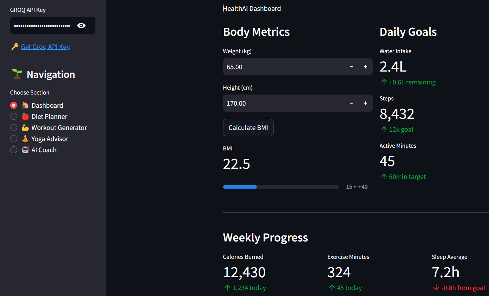

# HealthAI Advisor 🌿

[](https://your-app-url.streamlit.app/)
[](https://opensource.org/licenses/MIT)

An AI-powered health and wellness assistant providing personalized diet plans, workout routines, yoga sequences, and real-time health coaching using Groq's lightning-fast LLMs.



## Features ✨

- **AI-Powered Recommendations**
  - 🍎 Personalized meal plans with macros
  - 💪 Custom workout routines by fitness level
  - 🧘 Yoga sequences with pose instructions
  - 🤖 Interactive health coaching chat

- **Health Dashboard**
  - 📊 BMI calculator with progress visualization
  - 💧 Daily hydration & activity tracking
  - 📈 Weekly progress metrics

- **Smart Customization**
  - 🥗 Dietary restrictions/allergy support
  - 🏋️ Equipment-aware workout plans
  - ⏱️ Duration-based exercise routines

## Prerequisites 📋

- Python 3.7+
- pip package manager
- [Groq API Key](https://console.groq.com/keys)

## Installation ⚙️

1. Clone the repository:
```bash
git clone https://github.com/aitiwari/HealthAIAdvisor.git
cd healthai-advisor
```

2. Install dependencies:
```bash
   pip install -r requirements.txt
```
3. Set up your Groq API key:
```bash
echo "GROQ_API_KEY=your_api_key_here" > .env
```

## Usage 🚀

1. Start the application:
```bash
streamlit run app.py
```
2. Explore features through the sidebar navigation:

    🏠 Dashboard: Track health metrics

    🍎 Diet Planner: Generate meal plans

    💪 Workout Generator: Create exercise routines

    🧘 Yoga Advisor: Get customized yoga sequences

    🤖 AI Coach: Chat with health assistant

## Acknowledgments 🙏
    Powered by Groq LPUs

    Built with Streamlit

    Health insights from Mixtral-8x7b AI model

    Fitness data recommendations from health community knowledge